<div align="center">

# 🧠 MindTrace

### Text Mining & NLP-Driven Emotion Prediction

A unified benchmarking study comparing SVM, XGBoost, CNN, and BiLSTM on 416K Twitter samples across 6 emotion classes — with a production-ready Flask deployment.

<br>

[](https://python.org)
[](https://flask.palletsprojects.com)
[](https://scikit-learn.org)
[](https://hub.docker.com/r/yolandalim/125970-mindtrace)
[](http://192.41.170.112:5970/)

**Aye Khin Khin Hpone (Yolanda Lim)** · ST125970  
Computer Science · Asian Institute of Technology

<br>

[Live Demo](http://192.41.170.112:5970/) · [YouTube](https://youtu.be/9etx8PFHcxQ) · [Docker Hub](https://hub.docker.com/r/yolandalim/125970-mindtrace) · [Source Code](https://github.com/limhpone/st125970-MindTrace-yolanda-ML-Final-Project)

<br>


</div>

---

## Table of Contents

- [🧠 MindTrace](#-mindtrace)
    - [Text Mining \& NLP-Driven Emotion Prediction](#text-mining--nlp-driven-emotion-prediction)
  - [Table of Contents](#table-of-contents)
  - [Research Question](#research-question)
  - [Highlights](#highlights)
  - [Model Performance](#model-performance)
  - [Dataset](#dataset)
    - [Web Application](#web-application)
  - [Methodology](#methodology)
  - [NLP Preprocessing Pipeline](#nlp-preprocessing-pipeline)
  - [Project Structure](#project-structure)
  - [Quick Start](#quick-start)
    - [Option 1 — Local Python](#option-1--local-python)
    - [Option 2 — Docker (build locally)](#option-2--docker-build-locally)
    - [Option 3 — Docker Hub (no build required)](#option-3--docker-hub-no-build-required)
  - [API Reference](#api-reference)
    - [`POST /predict`](#post-predict)
    - [`GET /stats`](#get-stats)
    - [`GET /health`](#get-health)
  - [Web UI](#web-ui)
  - [Environment Variables](#environment-variables)
  - [Dependencies](#dependencies)
  - [Reproducing Results](#reproducing-results)
  - [Citation \& Acknowledgements](#citation--acknowledgements)

---

## Research Question

> *How do traditional ML models (SVM, XGBoost) compare with deep learning models (CNN, BiLSTM) in multi-class emotion classification from social media text, when evaluated under a unified preprocessing pipeline, standardised dataset partitioning, and consistent evaluation metrics?*

---

## Highlights

| Feature | Detail |
|---|---|
| **94.70% accuracy** | BiLSTM achieves best test accuracy across all 4 models |
| **Unified benchmark** | Same preprocessing, stratified splits, and macro-F1 evaluation |
| **Error taxonomy** | Confusion matrix analysis reveals Joy↔Love and Fear↔Surprise patterns |
| **Production deployed** | SVM + TF-IDF in Flask with Docker & CI/CD at sub-ms inference |
| **Rich dashboard** | Interactive charts, training curves, live session analytics |
| **8-step NLP trace** | Full pipeline visibility in every prediction |

---

## Model Performance

All models trained on the **same preprocessing pipeline** and **stratified dataset split** (80/20 with 20% validation holdout).

| Model | Train Acc. | Val Acc. | Test Acc. | Precision | Recall | F1-Score |
|:---|:---:|:---:|:---:|:---:|:---:|:---:|
| 🥇 **BiLSTM** | 94.7% | 94.2% | **94.70%** | 94.97% | 94.70% | 94.64% |
| 🥈 **CNN** | 93.2% | 92.8% | 93.13% | 93.47% | 93.13% | 93.05% |
| 🥉 **SVM** | 94.4% | 92.1% | 91.80% | 92.00% | 91.80% | 91.75% |
| 4th **XGBoost** | 93.3% | 91.1% | 80.93% | 85.48% | 80.93% | 81.50% |

> **Deployed model:** SVM + TF-IDF sklearn Pipeline — chosen for sub-millisecond CPU inference, no GPU needed.

<p align="center">
  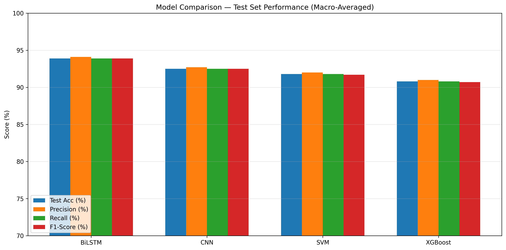
</p>

---

## Dataset

**Source:** [Kaggle — Emotions Dataset](https://www.kaggle.com/datasets/nelgiriyewithana/emotions)  

`416,809` labelled Twitter samples · `6` emotion classes · Imbalance ratio `9.5:1`

| Emotion | Code | Count | Share | Note |
|:---|:---:|---:|:---:|:---|
| 😊 Joy | 1 | 141,067 | 33.84% | Largest class — risk of bias if unweighted |
| 😢 Sadness | 0 | 121,187 | 29.07% | Semantically close to Fear and Love |
| 😠 Anger | 3 | 57,317 | 13.75% | Distinct vocabulary aids separation |
| 😨 Fear | 4 | 47,712 | 11.45% | Often confused with Surprise |
| ❤️ Love | 2 | 34,554 | 8.29% | Minority class |
| 😲 Surprise | 5 | 14,972 | 3.59% | Smallest — highest misclassification risk |

> **High-risk confusion pairs:** Fear ↔ Surprise (arousal overlap) · Joy ↔ Love (valence conflation)

<p align="center">
  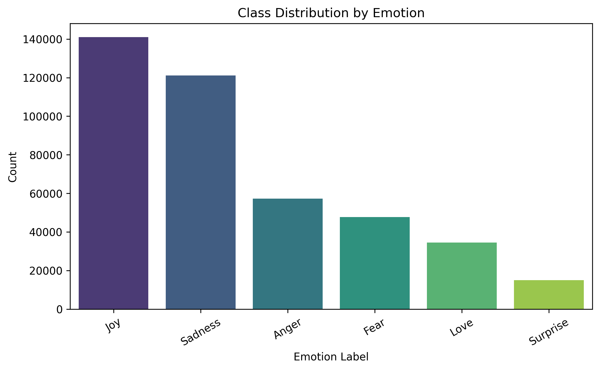
</p>

---

### Web Application

<p align="center">
  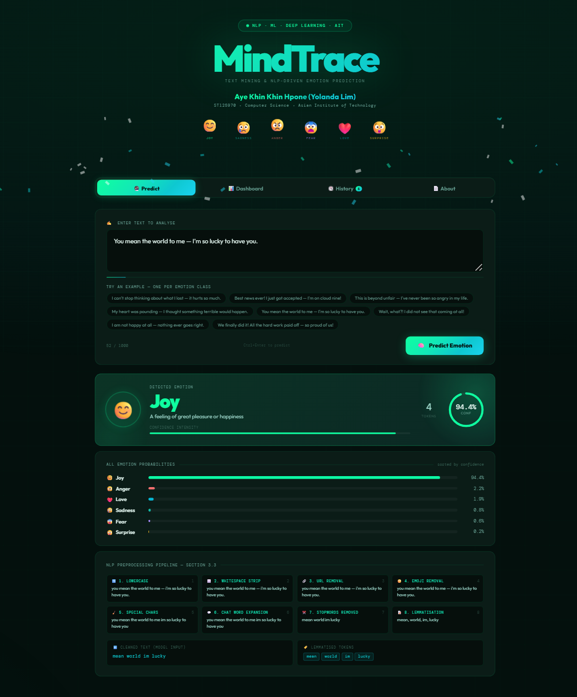
  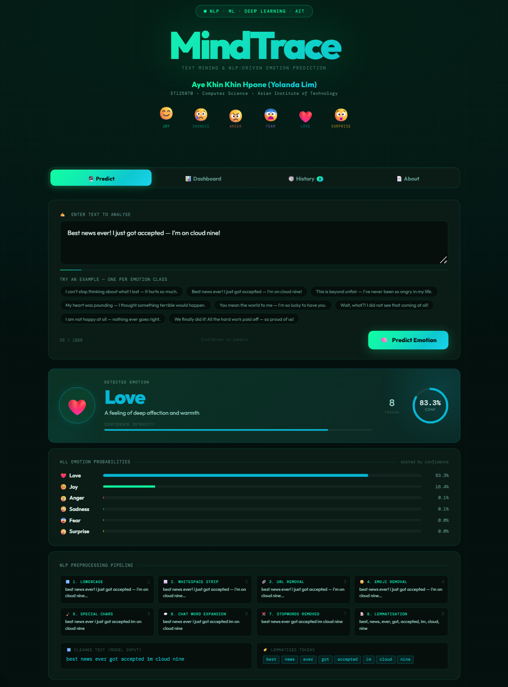
  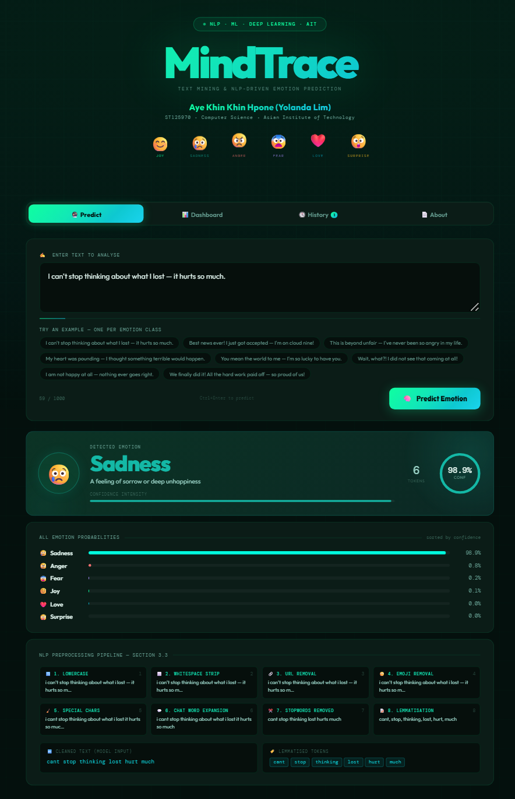
</p>

<details>
<summary><strong>View more screenshots</strong></summary>

<br>

<p align="center">
  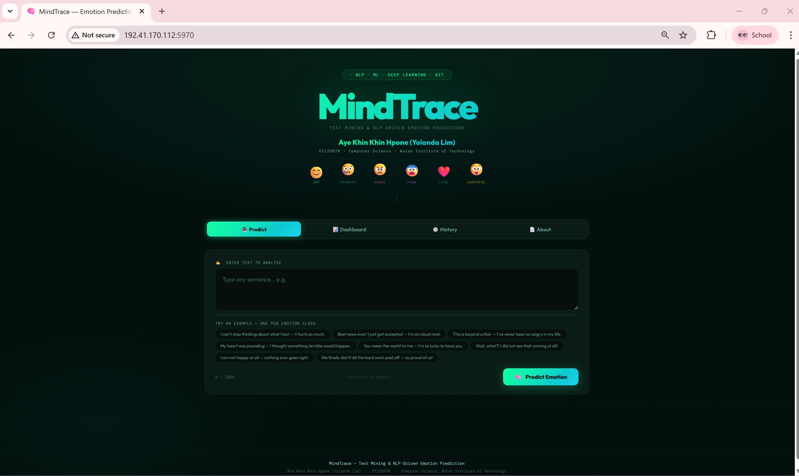
  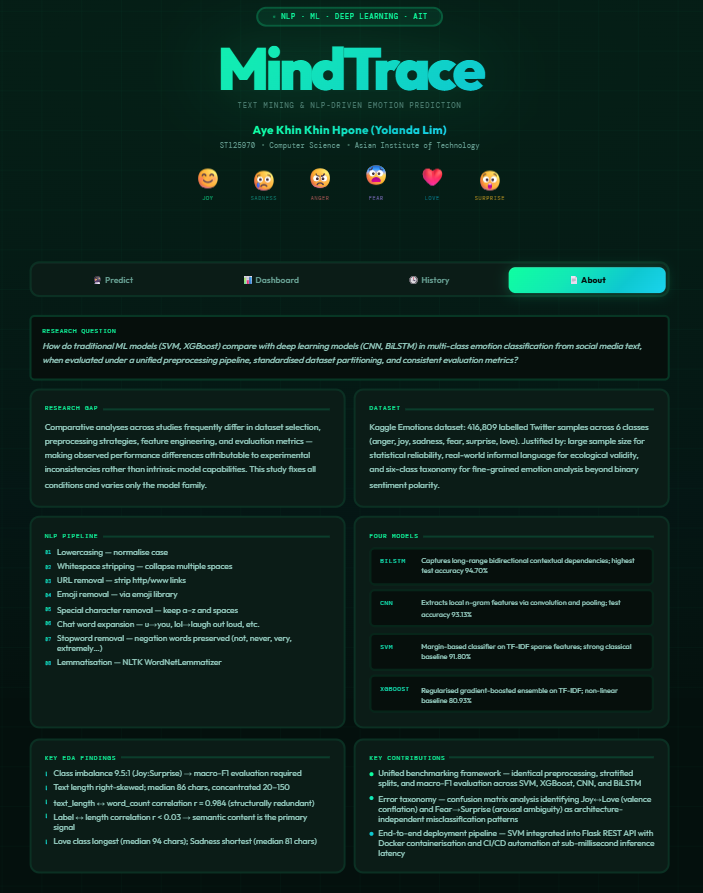
</p>

<p align="center">
  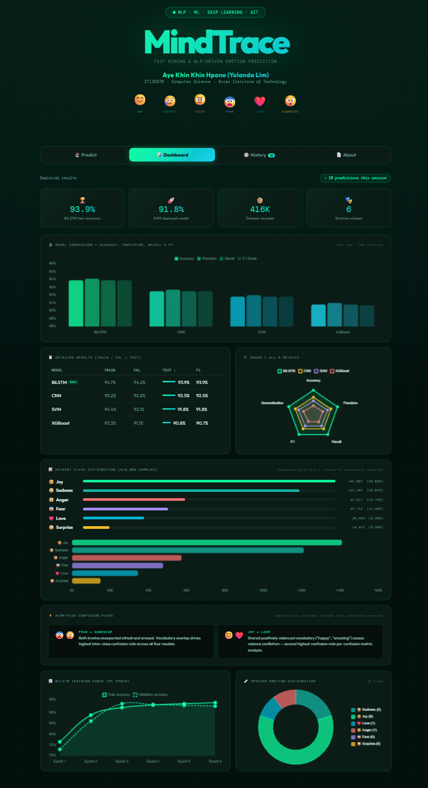
  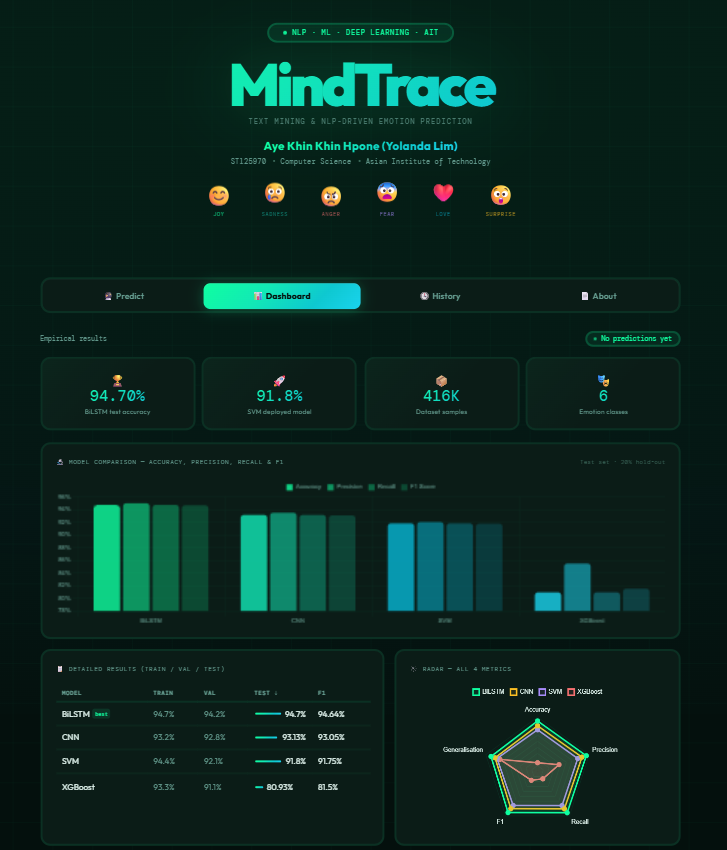
</p>

<p align="center">
  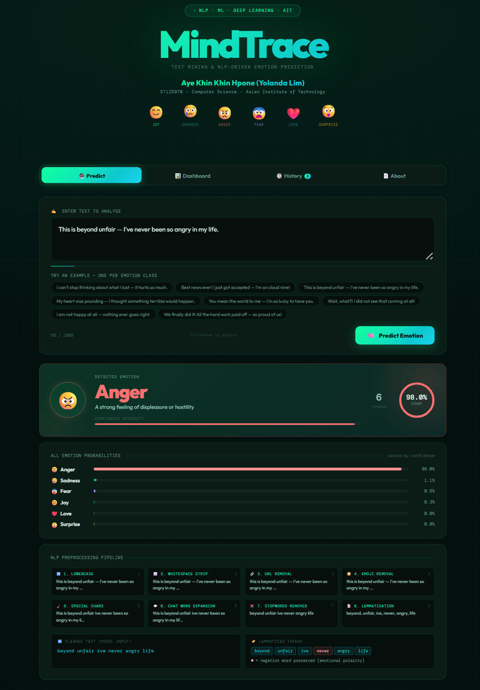
  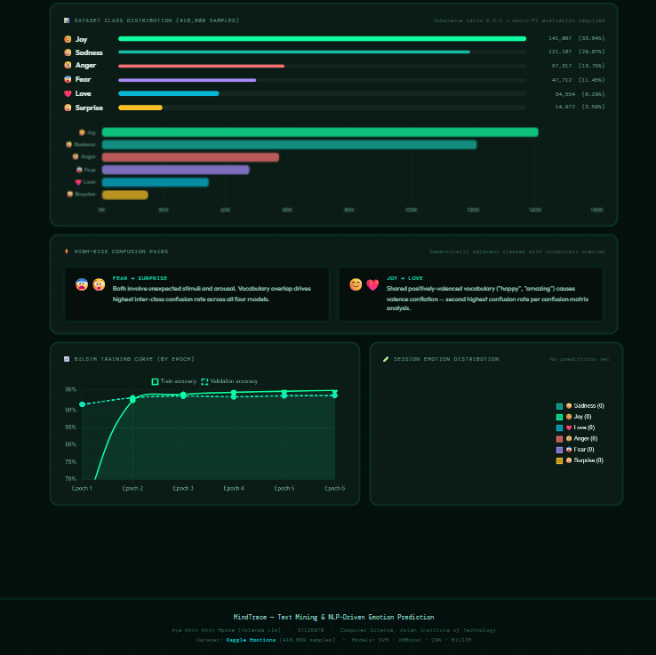
</p>

</details>

---

## Methodology

<p align="center">
  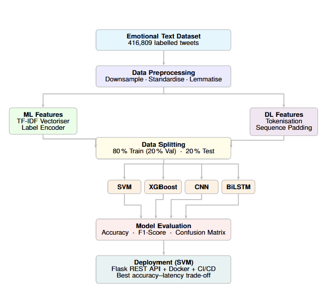
</p>

The pipeline follows a controlled experimental design:

1. **Exploratory Data Analysis** — Class distribution, text length statistics, and correlation analysis to inform design decisions
2. **Class balancing** — Random downsampling to 14,972 samples per class (89,832 total)
3. **Text preprocessing** — 8-step NLP pipeline including stopword removal with negation retention, lemmatisation, and chat-word expansion
4. **Feature engineering** — TF-IDF (5k features, uni+bigrams) for ML models; tokenisation, padding, and trainable embedding (d=100) for DL models
5. **Stratified split** — 80% train / 20% test, with 20% validation holdout from training (seed=42)
6. **Hyperparameter tuning** — Grid search with 3-fold CV for ML models; EarlyStopping (patience=3) for DL models
7. **Training & evaluation** — All four models evaluated on the same test set using Macro-F1 (primary), accuracy, precision, recall, and confusion matrix
8. **Model selection** — Accuracy–latency trade-off and computational cost comparison
9. **Ablation study** — Two complementary retrospective analyses: (A) SVM preprocessing ablation disabling each of the 8 pipeline steps individually, and (B) BiLSTM architecture ablation testing depth, capacity, dropout, and embedding dimensionality
10. **Deployment** — SVM deployed via Flask REST API with Docker containerisation and GitHub Actions CI/CD

---

## NLP Preprocessing Pipeline

Applied identically in `train_pipeline.py` during training and in `app.py` at inference time.

| Step | Operation | Detail |
|:---:|---|---|
| 1 | Lowercase | `str.lower()` |
| 2 | Whitespace stripping | Collapse multiple spaces, strip leading/trailing |
| 3 | URL removal | `re.sub(r'http\S+\|www\S+', '', t)` |
| 4 | Emoji removal | `emoji.replace_emoji(t, replace='')` |
| 5 | Special character removal | Keep only `[a-z\s]` |
| 6 | Chat word expansion | `u→you`, `lol→laugh out loud`, 31 rules |
| 7 | Stopword removal | NLTK English stopwords — **negation words preserved** |
| 8 | Lemmatisation | `nltk.WordNetLemmatizer` |

**Negation words preserved:**  
`not` · `never` · `no` · `nor` · `neither` · `nothing` · `nobody` · `nowhere` · `without` · `very` · `extremely` · `barely` · `hardly`

These carry emotional polarity — removing them would lose discriminative signal.

---

## Project Structure

```
mindtrace/
├── app.py                        # Flask API — loads model.pkl, serves UI
├── train_pipeline.py             # Trains and saves model.pkl from the dataset
├── model.pkl                     # Serialised sklearn Pipeline (SVM + TF-IDF)
├── requirements.txt              # Pinned Python dependencies
├── Dockerfile                    # Container definition (python:3.11-slim + gunicorn)
│
├── templates/
│   └── index.html                # MindTrace web UI (4 tabs — self-contained)
│
├── Emotion_prediction_source_code.ipynb   # Full training notebook (CNN / BiLSTM)
├── test_predict.ipynb            # Inference tests — 6 classes + batch prediction
├── ablation_study.ipynb          # Ablation study notebook
│
└── data/
    └── text.xlsx                 # Raw dataset — download separately from Kaggle
```

---

## Quick Start

### Option 1 — Local Python

```bash
# 1. Clone / download this folder
cd mindtrace

# 2. Install dependencies
pip install -r requirements.txt

# 3. Download the dataset
#    https://www.kaggle.com/datasets/nelgiriyewithana/emotions
#    Save as: data/text.xlsx

# 4. Train and save model.pkl  (~5–15 min depending on hardware)
python train_pipeline.py --data data/text.xlsx

# 5. Start the server
python app.py
#    → Open http://localhost:5000
```

### Option 2 — Docker (build locally)

```bash
# model.pkl must exist first — run step 4 above
docker build -t mindtrace .
docker run -p 5000:5000 mindtrace
#    → Open http://localhost:5000
```

### Option 3 — Docker Hub (no build required)

```bash
docker pull yolandalim/125970-mindtrace:latest
docker run -p 5000:5000 yolandalim/125970-mindtrace:latest
#    → Open http://localhost:5000
```

> **Note:** The [live demo](http://192.41.170.112:5970/) maps the container's port 5000 to external port 5970 (`-p 5970:5000`).

---

## API Reference

### `POST /predict`

Accepts raw text, returns emotion label with probabilities and NLP step trace.

**Request**
```json
{ "text": "I feel so happy today!" }
```

**Response**
```json
{
  "prediction":   "Joy",
  "emoji":        "😊",
  "color":        "#0fffa0",
  "orb":          "rgba(15,255,160,0.18)",
  "description":  "A feeling of great pleasure or happiness",
  "confidence":   87.43,
  "all_emotions": [
    { "label": "Joy",      "probability": 87.43, "emoji": "😊", "color": "#0fffa0" },
    { "label": "Love",     "probability":  6.12, "emoji": "❤️", "color": "#06b6d4" },
    { "label": "Sadness",  "probability":  3.21, "emoji": "😢", "color": "#14b8a6" },
    { "label": "Surprise", "probability":  1.45, "emoji": "😲", "color": "#fbbf24" },
    { "label": "Anger",    "probability":  1.02, "emoji": "😠", "color": "#f87171" },
    { "label": "Fear",     "probability":  0.77, "emoji": "😨", "color": "#a78bfa" }
  ],
  "cleaned_text": "feel happy today",
  "tokens":       ["feel", "happy", "today"],
  "nlp_steps": {
    "lowercased":          "i feel so happy today!",
    "whitespace_stripped": "i feel so happy today!",
    "url_removed":         "i feel so happy today!",
    "emoji_removed":       "i feel so happy today!",
    "special_removed":     "i feel so happy today",
    "chat_expanded":       "i feel so happy today",
    "stopwords_removed":   "feel happy today",
    "lemmatised":          ["feel", "happy", "today"]
  },
  "negations_kept": [],
  "history": [...]
}
```

---

### `GET /stats`

Returns all model performance metrics and class distribution for the dashboard.

```json
{
  "model_stats": {
    "BiLSTM":  { "train": 94.7, "val": 94.2, "test": 94.70, "precision": 94.97, "recall": 94.70, "f1": 94.64 },
    "CNN":     { "train": 93.2, "val": 92.8, "test": 93.13, "..." : "..." },
    "SVM":     { "train": 94.4, "val": 92.1, "test": 91.80, "..." : "..." },
    "XGBoost": { "train": 93.3, "val": 91.1, "test": 80.93, "..." : "..." }
  },
  "class_distribution": { "...": "..." },
  "dataset_size":    416809,
  "best_model":      "BiLSTM (94.70% test accuracy)",
  "imbalance_ratio": "9.5:1 (Joy:Surprise)",
  "hard_pairs":      ["Fear / Surprise", "Joy / Love"]
}
```

---

### `GET /health`

```json
{ "status": "ok", "model": "model.pkl", "project": "MindTrace" }
```

---

## Web UI

The app ships a single-page, self-contained UI with four tabs.

| Tab | Content |
|---|---|
| **Predict** | Text input with 8 example pills (one per emotion + 2 negation examples). After prediction: animated emoji, confidence ring, intensity bar, word count, probability bars for all 6 emotions, and the 8-step NLP trace with negation tokens highlighted. |
| **Dashboard** | 4 KPI cards · Grouped bar chart (all 4 metrics) · Performance table with mini bars · Radar chart · Class distribution with animated inline bars + horizontal chart · BiLSTM training curve · Live session doughnut (updates as you predict). |
| **History** | Session prediction log with emotion summary chips (×count per label) and clear-all button. Badge counter on the tab itself. |
| **About** | Research question · Research gap · Dataset justification · NLP pipeline · All 4 model descriptions · 5 key EDA findings · 3 contribution points. |

**Interactive features:**
- Confetti animation on high-confidence Joy predictions (≥ 72%)
- Gold star burst on Surprise predictions (≥ 62%)
- Keyboard shortcut `Ctrl+Enter` to predict
- Hovering on emotion floaters pauses their animation

---

## Environment Variables

| Variable | Default | Description |
|---|---|---|
| `PORT` | `5000` | Flask / Gunicorn listen port |
| `MODEL_PATH` | `model.pkl` | Path to the serialised sklearn pipeline |

---

## Dependencies

| Package | Version | Used for |
|---|---|---|
| `flask` | 3.0.3 | Web framework |
| `scikit-learn` | 1.4.2 | TF-IDF vectoriser + SVM pipeline |
| `nltk` | 3.8.1 | Stopwords + lemmatiser |
| `emoji` | 2.12.1 | Emoji removal from text |
| `joblib` | 1.4.2 | Model serialisation / deserialisation |
| `numpy` | 1.26.4 | Array operations |
| `gunicorn` | 22.0.0 | Production WSGI server (Docker) |
| `pandas` | 2.2.2 | DataFrame handling *(training only)* |
| `openpyxl` | 3.1.2 | Read `.xlsx` dataset *(training only)* |
| `xgboost` | 2.0.3 | XGBoost baseline *(training only)* |

> `pandas`, `openpyxl`, and `xgboost` are commented out in `requirements.txt` by default — uncomment them when running `train_pipeline.py`.

---

## Reproducing Results

`train_pipeline.py` trains the **SVM** model deployed in this app and should achieve approximately **91.8% test accuracy**.

To reproduce the **BiLSTM (94.70%)** or **CNN (93.13%)** results, use the full `Emotion_prediction_source_code.ipynb` notebook in a TensorFlow environment (Google Colab with NVIDIA T4 GPU recommended).

---

## Citation & Acknowledgements

If you use this work, please cite:

```bibtex
@thesis{mindtrace2026,
  author  = {Aye Khin Khin Hpone (Yolanda Lim)},
  title   = {MindTrace: Text Mining and NLP-Driven Emotion Prediction Using Machine Learning and Deep Learning Approaches},
  school  = {Asian Institute of Technology},
  year    = {2026},
  type    = {Master's Project},
  note    = {Computer Science, April 2026}
}
```

**Acknowledgements** — Sincere thanks to **Dr. Sein Minn** for his supervision and guidance, and to **TA Rakshya Lama Moktan** for her valuable support and feedback.

---

<div align="center">

**Asian Institute of Technology · Computer Science · 2026**

Made with ❤️ by Yolanda Lim

</div>
